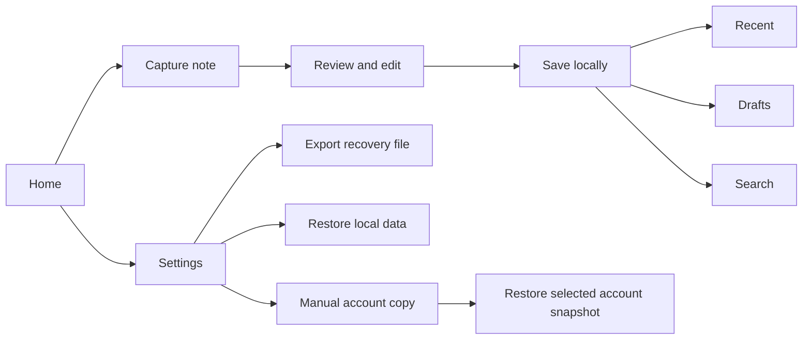
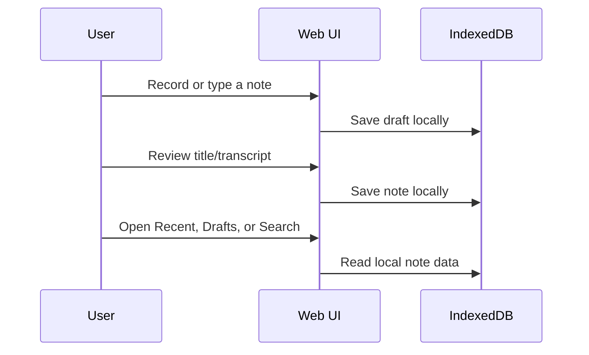
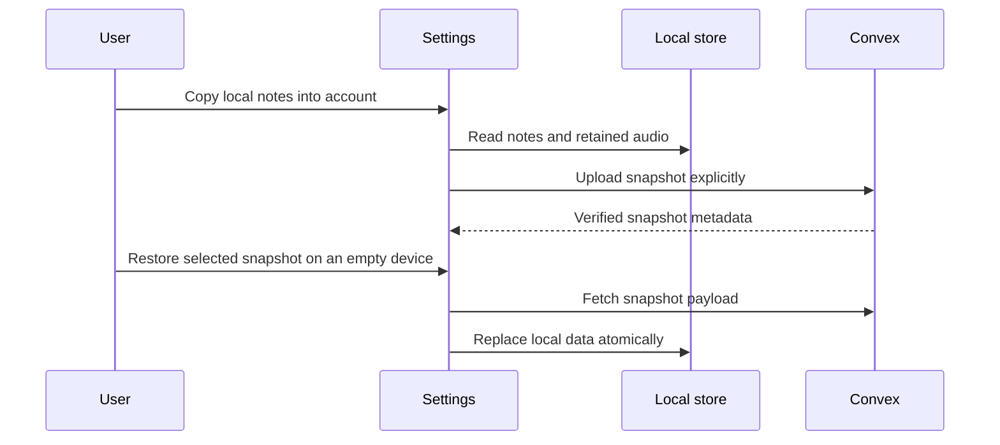
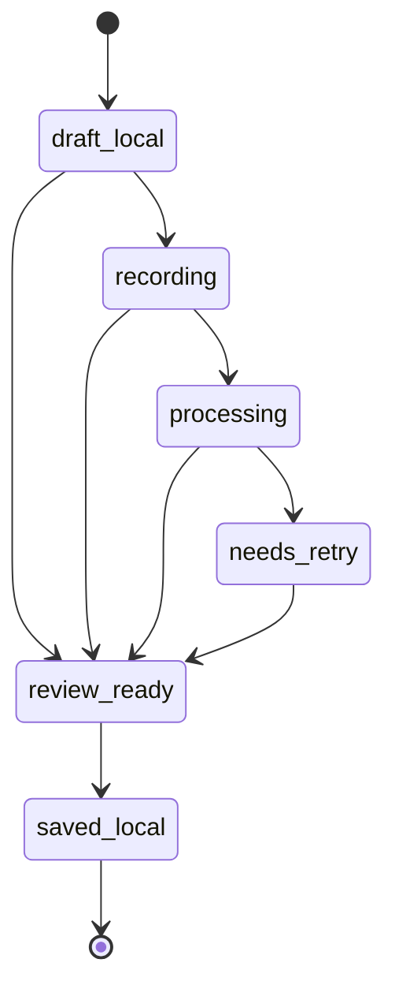
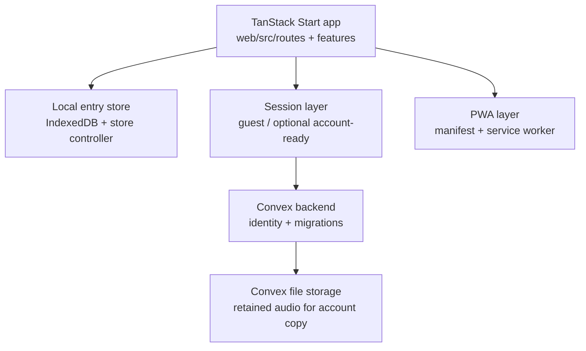

# Notes App Overview

Last updated: April 4, 2026

## What This App Is

Notes is a mobile-first, local-first journaling and note-capture web app. The live package-manager/runtime surface for the web app is Bun.

It is built for fast emotional or practical capture:

- speak a note
- type a note
- review it
- save it locally
- find it later without friction

The product stays intentionally honest about trust boundaries:

- your notes live on the current device by default
- account copy is explicit, not automatic
- restore is explicit, not hidden background sync

## Product In One Picture



## Core User Flows

### 1. Local-first capture



### 2. Optional manual account copy



## What Users Can Do Today

### Capture and writing

- Create text notes without signing in.
- Create voice notes without signing in.
- See a microphone-use disclosure before the first mic permission request.
- Watch a live recording timer while voice capture is active.
- Review and edit note title and transcript before saving.
- Fall back to text if microphone permission is denied.
- Fall back to text if the browser cannot record safely.

### Storage and recovery

- Keep notes locally in IndexedDB.
- Recover drafts after reload.
- Export a full local recovery file as JSON.
- Restore local notes from a validated recovery file.
- Delete all local notes and retained audio from the current device.
- Delete retained audio while keeping the transcript note.
- Delete a saved note directly from its note screen.

### Retrieval

- Browse Drafts.
- Browse Recent notes.
- Search locally across titles and transcripts.
- See relative and absolute timestamps in retrieval lists.

### Multi-tab and trust behavior

- See a warning when the same note is open in another tab.
- Get automatic refresh after destructive changes from another tab.
- See explicit unavailable-state handling when another tab deletes or replaces a note.

### Install and offline

- Install the web app where the browser supports it.
- Use manual Add to Home Screen guidance on iPhone/iPad.
- Reload the app offline into a working cached shell.
- See a visible offline banner when the network drops.

### Account-copy behavior

- Optionally prepare account mode with Clerk + Convex when configured.
- Manually copy the current device snapshot into the signed-in account.
- Verify whether the copied account snapshot is current or stale.
- Delete the copied account snapshot without touching local notes.
- Restore an empty device from the copied snapshot for the same device session.
- Restore an empty device from another copied device-session snapshot in the same account.

## What The App Does Not Claim To Do

- No live background sync.
- No remote note library UI.
- No remote search.
- No automatic cross-device merge.
- No hidden backup before the user explicitly copies data into the account.

## Note Lifecycle



## Architecture



## Key Technical Decisions

| Area | Current decision |
| --- | --- |
| Frontend | TanStack Start + React 19 |
| Local persistence | IndexedDB |
| Styling | Tailwind CSS 4 |
| Backend boundary | Convex |
| Optional auth | Clerk |
| Deployment target | Vercel |
| Testing | Vitest + Playwright |

## Trust Model

| Situation | What it means |
| --- | --- |
| Default use | Notes stay on the current device |
| Export | User downloads a full local recovery snapshot |
| Manual account copy | User explicitly uploads a snapshot into the signed-in account |
| Restore from account copy | User explicitly replaces an empty device with one selected account snapshot |
| No account copy action | The app should not be treated as backed up |

## Main Screens

| Route | Purpose |
| --- | --- |
| `/` | Home and capture entry point |
| `/note/$noteId` | Voice/text note workspace |
| `/drafts` | Local drafts |
| `/recent` | Saved local notes |
| `/search` | Local search |
| `/settings` | Privacy, recovery, install, and account-copy controls |

## How To Run It

### Fast local-first run

1. Open a terminal.
2. Go to the app:

```bash
cd /Users/michal/Documents/MyApps/Notes/web
```

3. Install dependencies if needed:

```bash
bun install
```

4. Start the dev server:

```bash
bun run dev
```

5. Open the local URL printed by Vite.

This mode works without Convex or Clerk. The app stays local-first.

### Production-style local run

```bash
cd /Users/michal/Documents/MyApps/Notes/web
bun run build
bun run start
```

## Optional Environment For Account Copy

The account-copy path is optional. The app still runs without it.

| Variable | Needed for |
| --- | --- |
| `VITE_ENABLE_OPTIONAL_AUTH=1` | Enables optional auth path |
| `VITE_CONVEX_URL` | Convex client connection |
| `VITE_CLERK_PUBLISHABLE_KEY` | Clerk client runtime |
| `VITE_CLERK_JWT_ISSUER_DOMAIN` | Convex + Clerk account prep |
| `CLERK_SECRET_KEY` | Server-side Clerk middleware |

If those variables are missing, the app still runs, but account copy and authenticated preparation stay unavailable.

## Useful Commands

```bash
cd /Users/michal/Documents/MyApps/Notes/web
bun run dev
bun run test
bun run build
bun run lint
bun run test:e2e -- --project=chromium --workers=1 --reporter=dot
```

## Current Verification Status

Verified on April 4, 2026:

- `bun run test`
- `bun run build`
- `bun run lint`
- `bun run test:e2e -- --project=chromium --workers=1 --reporter=dot`

## Best Files To Read First

- `web/src/routes/index.tsx`
- `web/src/routes/note/$noteId.tsx`
- `web/src/routes/settings.tsx`
- `web/src/features/entries/localStore.ts`
- `web/src/lib/auth/sessionContext.tsx`
- `web/convex/migrations.ts`

## Current Status In Plain English

This is no longer just a prototype. It is a serious local-first proof of concept with working note capture, recovery, offline behavior, and a bounded account-copy system.

It is still not the same thing as a fully synced production note platform. The biggest remaining product gap is ongoing remote sync and a true cross-device note library. Right now, the safe promise is:

- capture locally
- recover locally
- optionally copy a snapshot into an account
- explicitly restore that snapshot later
